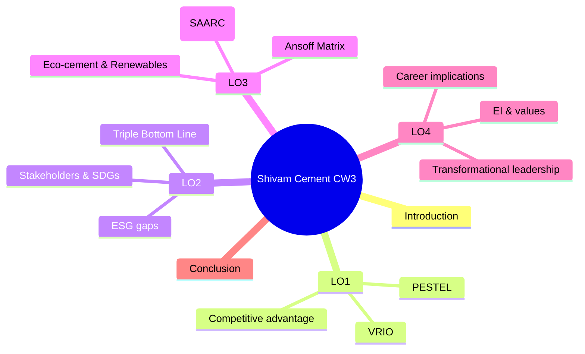

# Strategic Evaluation of Shivam Cement Ltd
### **Integrating Sustainability, Ethics, and Leadership for Global Competitiveness**


This repository contains a distinction-ready academic report for **BPP University – Organisational Strategy & Sustainability (CW3)**.  
It applies **VRIO**, **PESTEL**, **Ansoff**, **Triple Bottom Line (TBL)** and a **leadership reflection (LO4)** with narrative Harvard citations.

---

## 🎯 Objectives
- Deliver a 2,500-word report aligned to LO1–LO4.
- Move beyond description to **critical analysis** with theory application.
- Evidence-based recommendations for **eco-cement**, **renewable integration**, and **values-driven leadership**.

---

## 📁 Repository Structure
.
├─ /docs
│ ├─ images/ # exported figures & charts (place screenshots here)
│ ├─ diagrams/ # mermaid source blocks (copy from README)
│ └─ templates/ # cover sheet, checklists
├─ /references # PDFs / RIS files (if allowed), reference notes
├─ /output # final PDF/Word submission (your build)
├─ report/
│ ├─ 01_introduction.md
│ ├─ 02_LO1_vrio_pestel.md
│ ├─ 03_LO2_tbl_esg.md
│ ├─ 04_LO3_ansoff_options.md
│ ├─ 05_LO4_reflection.md
│ └─ 06_conclusion.md
└─ README.md


> ⚠️ **Academic integrity:** Keep this repo **private** until assessment is concluded. If you used any AI to *review* or *correct language*, retain prompts and outputs in `/docs/appendix_ai/` per BPP policy.

---

## 🧩 Visual Overview (Mermaid)

### Report Map


## Ansoff Options Snapshot
flowchart LR
A[Current Core Business] --> B[Market Penetration: AI demand forecasting, logistics optimisation]
A --> C[Market Development: SAARC exports, regional partners]
A --> D[Product Development: Low-emission eco-cement]
A --> E[Diversification: Precast & green materials]

## Sustainability Lens (TBL)
pie title Triple Bottom Line Focus
  "People (CSR, education, inclusion)" : 33
  "Planet (emissions, renewables, reporting)" : 34
  "Profit (resilient growth, exports)" : 33

_You can export these diagrams as PNGs on GitHub by copying the code blocks into a Mermaid-compatible editor or using VS Code + Mermaid extension._

## 🧠 Key Framework Illustrations

### VRIO (snapshot)
| Resource/Capability      | V | R | I | O | Implication                         |
| ------------------------ | - | - | - | - | ----------------------------------- |
| Limestone reserves       | ✔ | ✔ | ✔ | ✔ | Sustained advantage (cost/security) |
| European kiln technology | ✔ | ✔ | ✖ | ✔ | Temporary advantage                 |
| ESG reporting capability | ✖ | ✖ | ✖ | ✖ | Competitive parity / gap            |
| Digital logistics (AI)   | ✔ | ✖ | ✖ | ✖ | Potential advantage if organised    |

### PESTEL (high-level)
* P: Industrial policy support vs political instability
* E: Construction demand vs FX/import cost exposure
* S: Urbanisation; demand for quality & safety
* T: Automation, predictive maintenance opportunities
* E: Emissions pressure; alignment with SDGs
* L: Evolving environmental standards; future tightening

## ✍️ Citation & Referencing (Harvard, narrative style)
* Cite models in-text narratively, e.g., “Barney (1991) argued…”, “Elkington (1999) introduced…”.
* Include full references in /references/reference-list.md.
* Aim for 20+ credible sources (journals, books, company pages, reputable industry reports).
* Example narrative citations used in the report
* Barney (1991) on VRIO and sustained advantage
* Elkington (1999) on Triple Bottom Line
* Ansoff (1957) on growth strategy choices
* Kim and Mauborgne (2017) on blue ocean innovation
* United Nations (2023) on SDG alignment

## 🧪 How to Use This Repo
### 1. Clone
```git clone https://github.com/<your-username>/shivam-cement-strategy-sustainability-report.git```

### 2. Drafting
* Write in the ```/report``` files by LO section.
* Keep figures in ```/docs/images.```

### 3. Export
* Combine markdown into Word/PDF with your preferred tool (e.g., Pandoc).

### 4. Quality Check
* Run through the rubric checklist below before final export.

## ✅ Rubric-Aligned Checklist
* Critical analysis vs description: Every model applied and evaluated.
* Global context: EU/SAARC comparisons where relevant.
* Narrative Harvard citations: Consistent throughout.
* Formatting: BPP cover sheet, ToC, page numbers, labelled figures.
* LO4: First-person, theory-grounded reflection.

## 🖼️ Placeholders for Visuals
* Add your own figures to ```/docs/images/``` and embed like:


## 📜 License
- MIT License for repository scaffolding and README.
- Note: Your report content is subject to your university’s academic policies.

## 🙌 Acknowledgements
Thanks to course texts and peer-reviewed sources that underpin the strategic and sustainability analysis. See ```/references/reference-list.md``` for the complete bibliography.
